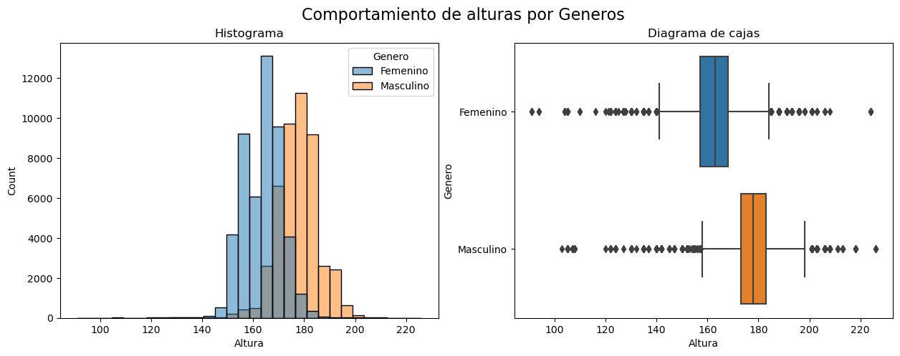

## Projecto: Analisis descriptivo de datos
***
El presente reporte, tiene como objetivo la descripcion de los datos obtenidos de "The Behavioral Risk Factor Surveillance System (BRFSS)", que viene a ser el sistema de recoleccion de datos sobre salud en estados unidos, realizado por Centers for Disease Control and Prevetion el cual es el organismo que vela por la salud publica a traves de ciencia y analisis de datos.

Los datos han sido descargados de la plataforma educativa DataCamp y trabajados en python.

Pagina Web - [The Behavioral Risk Factor Surveillance System (BRFSS)](https://www.cdc.gov/brfss/)

El prosito es del mostrar mis habilidades en el procesamiento de los de los datos y la capacidad de obtener información de ellos.

***

### EDA - EL PRIMER VISTAZO

La base de datos tiene un tamaño de 9 columnas y 99938 filas, con datos sobre edad, altura, peso, alimentación, ingresos y genero. El campo con mas datos completados, es el de genero, concluyendo que los encuestados contestaban al menos esa pregunta y podrian haber dejado las demás.

Como datos iniciales, existen 51,349 personas identificadas con el genero femenino y 48,589 con el genero masculino. 

En el caso de las alturas, agrupe el analisis por genero por el hecho que hay un diferencia entre el desarrollo fisico y el genero.

En la imagen se aprecia los histogramas y diagrama de cajas por altura y genero, donde el promedio y mediana del genero masculino es mayor al del femenino

