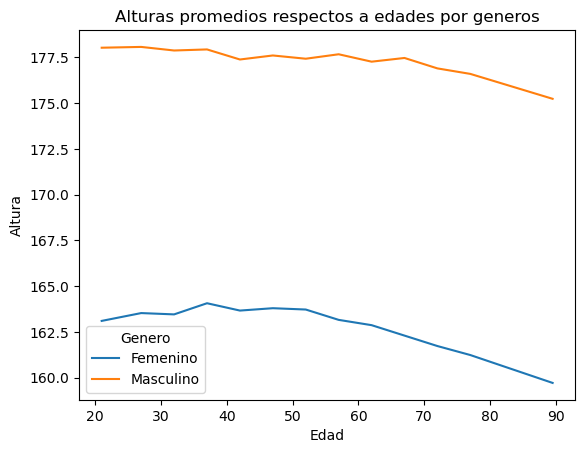
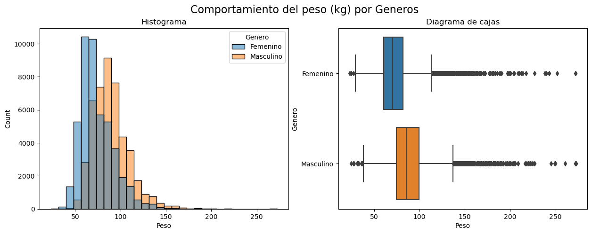
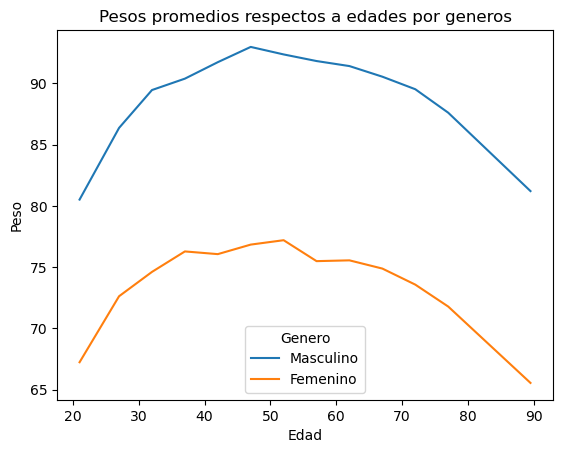

## Projecto: Analisis descriptivo de datos
***
El presente reporte, tiene como objetivo la descripcion de los datos obtenidos de "The Behavioral Risk Factor Surveillance System (BRFSS)", que viene a ser el sistema de recoleccion de datos sobre salud en estados unidos, realizado por Centers for Disease Control and Prevetion el cual es el organismo que vela por la salud publica a traves de ciencia y analisis de datos.

Para el datalle de la extracción y transformación, revisar el siguiente notebook donde se realizó todo el analisis [Notebook BRFSS](alturas.png)

Los datos han sido descargados de la plataforma educativa DataCamp y trabajados en python.

Pagina Web - [The Behavioral Risk Factor Surveillance System (BRFSS)](https://www.cdc.gov/brfss/)

El prosito es del mostrar mis habilidades en el procesamiento de los de los datos y la capacidad de obtener información de ellos.

***

### EDA - EL PRIMER VISTAZO

La base de datos tiene un tamaño de 9 columnas y 99938 filas, con datos sobre edad, altura, peso, alimentación, ingresos y genero. El campo con mas datos completados, es el de genero, concluyendo que los encuestados contestaban al menos esa pregunta y podrian haber dejado las demás.

Como datos iniciales, existen 51,349 personas identificadas con el genero femenino y 48,589 con el genero masculino. 

En el caso de las alturas, agrupe el analisis por genero por el hecho que hay una diferencia entre el desarrollo fisico y el genero.

En la imagen se aprecia los histogramas y diagrama de cajas por altura y genero, donde el promedio y mediana del genero masculino es mayor al del femenino. El genero masculino, el promedio de altura es de 178cm y en femenino es 163cm, con medianas de 178 y 163, con lo que se podria decir que el sesgo de los datos no es significativo.

Cruzando los datos de altura por genero y por las edades, podremos ver si la edad afecta la altura en el transcurso del tiempo.

Determinando una linea de tendencia para ambas gráficas, tenemos que el genero masculino disminuye a razon de 0.03 cm anualmente, desde elos 20 a 90 años, y en el femenino a razon de 0.05cm. Considerando la edad de 62 años con un limite para la vida laboral, en el genero masculino tiene un descenso de 0.07cm y en el femenino de 0.11 cm.

De la misma manera, resulta el analisis hecho para los pesos.

Donde el peso promedio del genero masculino es de 88kg y el del femenino de 73kg, sus medianas son de 86kg y 70kg respectivamente, lo que deja en evidencia un leve sesgo hacia la izquierda.

En la relacion de pesos y edades, se hizo el agrupamienot por genero.

Rescatamos de la grafica que en el genero masculino, existe un pico maximo de peso en promedio que es a de 92kg a los 42 años y de 77kg a los 52 años en el genero femenino.

