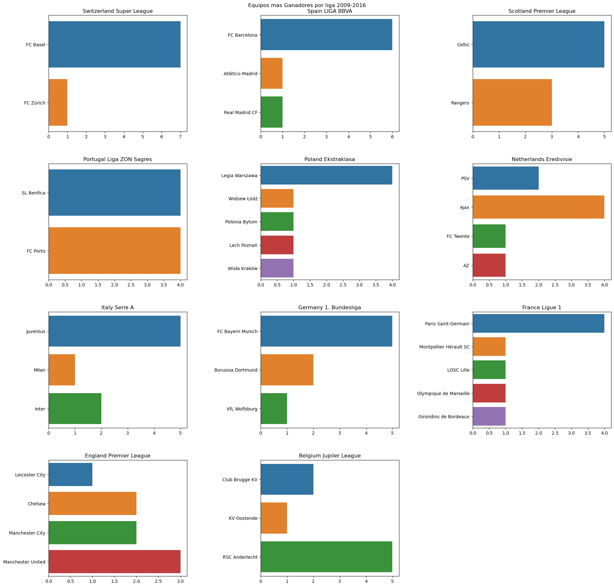

## Projecto: Analisis de Ligas Europeas - Temporadas desde 2009 hasta 2016 
***
El proyecto consiste en una analisis descriptivo en primera instancia sobre el comportamiento de los equipos las ligas europeas entre las temporadas 2009 al 2016, enfocado en los equipos campeones y las circunstancias en que se logra un campeonato.

Los datos son recogidos del reposistorio Kaggle [Datos de Ligas Europeas](https://www.kaggle.com/datasets/hugomathien/soccer)

***

### Carga de los Datos

La base de datos obtenida es del formato SQLAlchemy, la cual es extraida mediante codigo python.

```Python
inspector = inspect(engine)
schemas = inspector.get_schema_names()
for schema in schemas:
    print("schema: %s" % schema)
    for table_name in inspector.get_table_names(schema=schema):
        print(table_name)
```
Se verifican que existen muchas tablas relacionadas, por lo cual es consultan a todas las tablas para modelar los datos.

```Python
df_country = pd.read_sql_query('SELECT * FROM Country',engine)
df_league = pd.read_sql_query('SELECT * FROM League',engine)
df_match = pd.read_sql_query('SELECT * FROM Match',engine)
df_player = pd.read_sql_query('SELECT * FROM Player',engine)
df_player_attributes = pd.read_sql_query('SELECT * FROM Player_Attributes',engine)
df_team = pd.read_sql_query('SELECT * FROM Team',engine)
df_team_attributes = pd.read_sql_query('SELECT * FROM Team_Attributes',engine)
```
Teenemos tablas con datos sobre los paises, las ligas, los jugadores, los equipos y sobre los partidos que es la tabla donde se relacionan todos los demas.

### Analisis Descriptivo e Inferencial

#### Equipos Campeones por Liga
A continuacion se muestra un gráfico con los datos de los equipos ganadores por temporada.
 

En este grafico se muestran los campeones de las ligas europeas entre las temporadas 2009 a 2016, por ejemplo, el FC Barcelona es el que mas liga consigo en ese lapso de tiempo con 6, en Inglaterra, el equipo mas campeon es el Manchester United con 3 ligas obtenidas.

#### Evolucion de la Tabla Anual y Camino del Campeon
Añadiendo a los datos de los campeones anuales, tenemos un cuadro con los datos procesados de la evolucion de la tabla anual, esto se aplica para cualquier temporada y liga en cuestion.

| team                      |   1 |   2 |   3 |   4 |   5 |   6 |   7 |   8 |   9 |   10 |   11 |   12 |   13 |   14 |   15 |   16 |   17 |   18 |   19 |   20 |   21 |   22 |   23 |   24 |   25 |   26 |   27 |   28 |   29 |   30 |   31 |   32 |   33 |   34 |   35 |   36 |   37 |   38 |
|:--------------------------|----:|----:|----:|----:|----:|----:|----:|----:|----:|-----:|-----:|-----:|-----:|-----:|-----:|-----:|-----:|-----:|-----:|-----:|-----:|-----:|-----:|-----:|-----:|-----:|-----:|-----:|-----:|-----:|-----:|-----:|-----:|-----:|-----:|-----:|-----:|-----:|
| FC Barcelona              |   1 |   1 |   1 |   1 |   1 |   1 |   1 |   1 |   1 |    4 |    2 |    2 |    2 |    2 |    2 |    2 |    2 |    2 |    2 |    2 |    2 |    2 |    2 |    2 |    2 |    1 |    1 |    1 |    1 |    1 |    1 |    1 |    1 |    1 |    1 |    1 |    1 |    1 |
| Real Madrid CF            |   3 |  10 |  13 |   7 |   5 |   5 |   4 |   3 |   3 |    1 |    1 |    1 |    1 |    1 |    1 |    1 |    1 |    1 |    1 |    1 |    1 |    1 |    1 |    1 |    1 |    2 |    2 |    2 |    2 |    2 |    2 |    2 |    2 |    2 |    2 |    2 |    2 |    2 |
| Atlético Madrid           |   8 |   4 |   4 |   4 |   4 |   3 |   5 |   5 |   5 |    3 |    4 |    3 |    3 |    3 |    3 |    3 |    3 |    3 |    3 |    3 |    3 |    3 |    3 |    3 |    3 |    3 |    4 |    4 |    3 |    3 |    3 |    3 |    3 |    3 |    3 |    3 |    3 |    3 |
| Valencia CF               |  13 |   2 |   2 |   2 |   2 |   2 |   2 |   4 |   4 |    2 |    3 |    4 |    5 |    5 |    5 |    4 |    4 |    5 |    5 |    4 |    5 |    4 |    4 |    4 |    4 |    4 |    3 |    3 |    4 |    4 |    4 |    4 |    4 |    4 |    4 |    4 |    4 |    4 |
| Sevilla FC                |  11 |   6 |   3 |   3 |   3 |   4 |   3 |   2 |   2 |    5 |    5 |    5 |    4 |    4 |    4 |    6 |    5 |    4 |    4 |    5 |    4 |    5 |    5 |    5 |    5 |    5 |    5 |    5 |    5 |    5 |    5 |    5 |    5 |    5 |    5 |    5 |    5 |    5 |
| Villarreal CF             |   4 |   9 |   8 |   6 |   7 |   8 |   7 |   6 |   8 |    8 |    8 |    8 |    6 |    6 |    6 |    5 |    6 |    6 |    6 |    6 |    6 |    6 |    6 |    6 |    6 |    6 |    6 |    6 |    6 |    6 |    6 |    6 |    6 |    6 |    6 |    6 |    6 |    6 |
| Athletic Club de Bilbao   |  14 |   7 |  12 |  15 |  18 |  16 |  18 |  17 |  15 |   11 |   11 |    9 |    9 |   10 |   10 |   11 |   12 |   13 |   13 |   13 |   11 |   13 |   13 |   12 |   10 |    8 |    8 |    8 |    8 |    8 |    9 |    8 |    8 |    7 |    7 |    9 |    7 |    7 |
| RC Celta de Vigo          |   2 |   3 |   5 |   8 |   6 |   6 |   6 |   7 |   6 |    6 |    7 |    7 |    8 |    8 |    8 |    8 |    9 |    9 |   11 |   12 |   10 |   10 |    9 |    8 |    8 |    9 |   11 |   10 |   11 |   12 |   10 |    9 |    9 |    9 |    9 |   10 |   11 |    8 |
| Málaga CF                 |   6 |  13 |  11 |  11 |  10 |  13 |  11 |   8 |   7 |    7 |    6 |    6 |    7 |    7 |    7 |    7 |    7 |    7 |    7 |    7 |    7 |    7 |    7 |    7 |    7 |    7 |    7 |    7 |    7 |    7 |    7 |    7 |    7 |    8 |    8 |    7 |    8 |    9 |
| RCD Espanyol              |   9 |  16 |  19 |  17 |  11 |  12 |   8 |  11 |  10 |   13 |   12 |   14 |   12 |   13 |   11 |   10 |   10 |   10 |    9 |    9 |    9 |    9 |    8 |    9 |    9 |   10 |    9 |   12 |   12 |    9 |    8 |   10 |   10 |   10 |   10 |    8 |    9 |   10 |
| Rayo Vallecano            |  10 |  14 |  16 |  18 |  13 |   9 |  12 |   9 |   9 |   12 |   13 |   11 |   10 |   11 |   12 |   13 |   11 |   11 |   10 |   10 |   12 |   15 |   11 |   14 |   11 |   13 |   12 |   11 |    9 |   10 |   12 |   11 |   11 |   11 |   12 |   11 |   10 |   11 |
| Real Sociedad             |  16 |   8 |   7 |  12 |  14 |  15 |  15 |  16 |  17 |   19 |   15 |   16 |   14 |   14 |   14 |   14 |   13 |   12 |   12 |   11 |   13 |   12 |   12 |   10 |   12 |   11 |   10 |    9 |   10 |   11 |   11 |   12 |   12 |   12 |   11 |   12 |   12 |   12 |
| Elche CF                  |  20 |  19 |  10 |  13 |  16 |  18 |  16 |  18 |  19 |   17 |   18 |   19 |   19 |   20 |   20 |   20 |   20 |   19 |   16 |   17 |   19 |   17 |   17 |   17 |   17 |   15 |   15 |   15 |   16 |   16 |   15 |   14 |   14 |   13 |   13 |   13 |   13 |   13 |
| Getafe CF                 |  18 |  12 |  15 |  16 |  19 |  14 |  14 |  10 |  12 |   10 |    9 |   10 |   13 |   12 |   13 |   12 |   14 |   14 |   15 |   14 |   15 |   14 |   15 |   13 |   14 |   12 |   13 |   13 |   13 |   13 |   13 |   13 |   13 |   14 |   14 |   14 |   14 |   14 |
| Levante UD                |  19 |  20 |  20 |  20 |  17 |  19 |  17 |  19 |  20 |   18 |   19 |   13 |   15 |   15 |   15 |   15 |   17 |   18 |   19 |   19 |   20 |   18 |   19 |   18 |   18 |   17 |   18 |   18 |   15 |   15 |   18 |   16 |   15 |   15 |   15 |   15 |   15 |   15 |
| SD Eibar                  |   7 |  11 |  14 |   9 |   9 |   7 |   9 |  12 |  11 |    9 |   10 |   12 |   11 |    9 |    9 |    9 |    8 |    8 |    8 |    8 |    8 |    8 |   10 |   11 |   13 |   14 |   14 |   14 |   14 |   14 |   14 |   15 |   16 |   16 |   17 |   17 |   18 |   16 |
| RC Deportivo de La Coruña |  15 |  15 |   9 |  14 |  15 |  17 |  20 |  15 |  16 |   16 |   17 |   18 |   18 |   19 |   16 |   17 |   16 |   16 |   17 |   16 |   14 |   11 |   14 |   15 |   15 |   16 |   17 |   16 |   17 |   17 |   16 |   17 |   18 |   18 |   18 |   18 |   16 |   17 |
| Granada CF                |   5 |   5 |   6 |   5 |   8 |  11 |  13 |  14 |  14 |   15 |   14 |   15 |   16 |   16 |   17 |   18 |   19 |   20 |   20 |   20 |   18 |   20 |   18 |   19 |   19 |   19 |   19 |   19 |   19 |   19 |   19 |   19 |   19 |   19 |   19 |   19 |   17 |   18 |
| UD Almería                |  12 |  17 |  17 |  10 |  12 |  10 |  10 |  13 |  13 |   14 |   16 |   17 |   17 |   17 |   19 |   16 |   15 |   17 |   18 |   18 |   16 |   16 |   16 |   16 |   16 |   18 |   16 |   17 |   18 |   18 |   17 |   18 |   17 |   17 |   16 |   16 |   19 |   19 |
| Córdoba CF                |  17 |  18 |  18 |  19 |  20 |  20 |  19 |  20 |  18 |   20 |   20 |   20 |   20 |   18 |   18 |   19 |   18 |   15 |   14 |   15 |   17 |   19 |   20 |   20 |   20 |   20 |   20 |   20 |   20 |   20 |   20 |   20 |   20 |   20 |   20 |   20 |   20 |   20 |

En este caso, se muestra los datos de la campaña 2015-2016 de la liga española, donde el campeon fue el FC Barcelona, se nota que estuvo en primer lugar la mayoria del campeonato y a partir de la fecha 26 no bajo de la primera posicion.

#### Analisis de los campeones y la influencia de la localía.

Ahora se procede con el analisis de las victorias en todas las ligas.
```Python
data_final_season_amp[data_final_season_amp['points']==3]['location'].value_counts(normalize=True)*100
```
|      |   location |
|:-----|-----------:|
| home |    61.4817 |
| away |    38.5183 |

En este cuadro se muestra que en general, hay un 61% de victoras de local, lo que de muestra que jugar en casa pesa bastante en europa.

En el siguiente cuadro, se observan los niveles de victorias segun la localia y visita.


Todas las ligas tienen niveles parecido, donde siempre prima la localia, pero donde mas evidencia esto es en España e Italia a diferencia de Escocia donde es mas parejo.

#### Resultados minimos para Campeonar
Pasando al analisis del campeon, trato de buscar los resultados promedio que permiten a un equipo ganar la liga.

```Python
pd.pivot_table(index='points',columns='location',values='match_api_id',data=data_final_season_campeones,aggfunc='count').rename({0:'Derrota',1:'Empate',3:'Victoria'}).div(len(data_final_season_campeones)).mul(100)
```

| points   |     away |     home |
|:---------|---------:|---------:|
| Derrota  |  8.51269 |  3.4372  |
| Empate   | 11.5644  |  7.54899 |
| Victoria | 29.9068  | 39.0299  |

El cuadro anterior, muestra los resulados que se deben obtener minimamente, resultando que se deben obtener 39% de victorias como local, solo 3% de derrotas y 7% de empates, como visita se debe tener 29% de victorias, el 8.5% de derrotas y 11% de empates.

Estos porcentajes se pueden llevar a partidos, tomando como base 36 fechas en promedio.

```Python
pd.pivot_table(index='points',columns='location',values='match_api_id',data=data_final_season_campeones,aggfunc='count').rename({0:'Derrota',1:'Empate',3:'Victoria'}).div(len(data_final_season_campeones)).mul(36).round(0)
```

| points   |   away |   home |
|:---------|-------:|-------:|
| Derrota  |      3 |      1 |
| Empate   |      4 |      3 |
| Victoria |     11 |     14 |

Siendo que un equipo campeon, solo debe perder 4 partidos en todo el campeonato.


